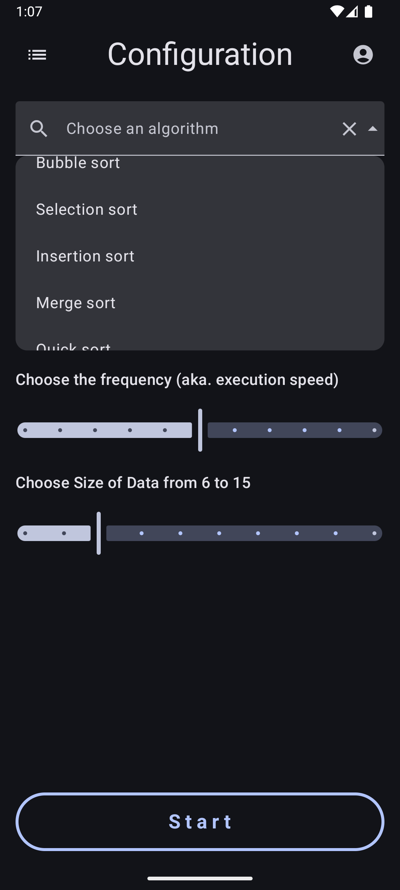
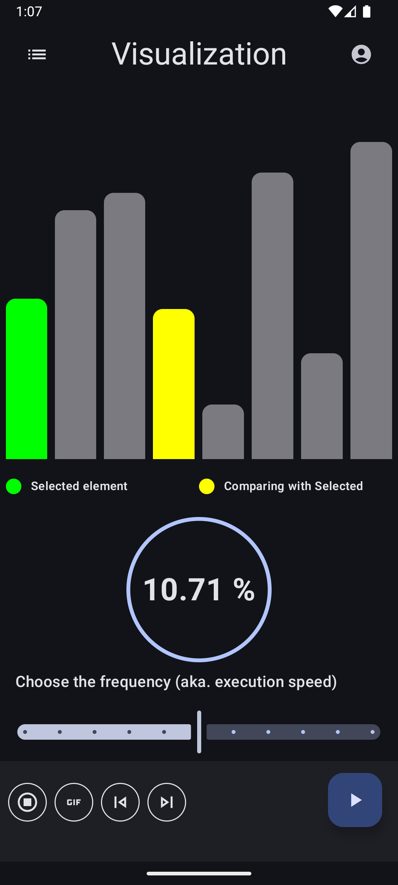
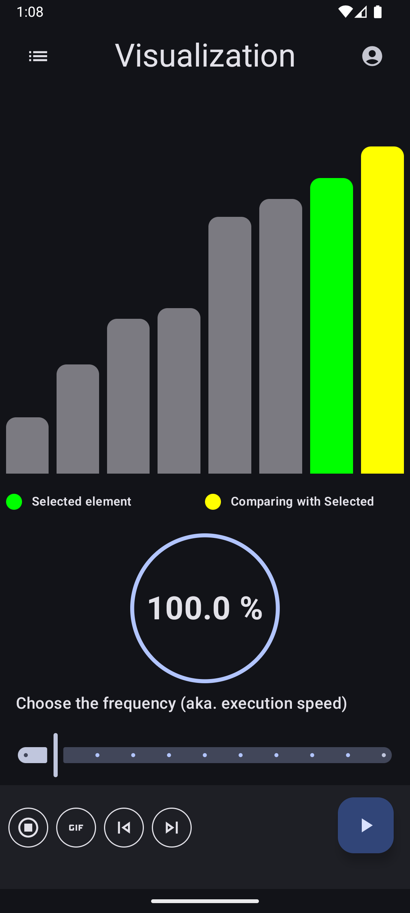

# Algorithm Visualizer

An Android application for visualizing and comparing different sorting algorithms in real-time, built with Jetpack Compose.

## Overview

Algorithm Visualizer is an educational tool designed to help users understand how various sorting algorithms work through interactive visualizations. The app allows users to select different sorting algorithms, configure parameters such as data size and animation speed, and watch the sorting process in action.

## Features

- Visualize multiple sorting algorithms:
  - Bubble Sort
  - Selection Sort
  - Insertion Sort
  - Merge Sort
  - Quick Sort
- Configure visualization parameters:
  - Adjust execution speed/frequency
  - Choose data size for sorting
- Interactive UI built with Jetpack Compose
- Modern Android architecture following MVVM pattern

## Screenshots





*[Screenshots will be added here]*

## Tech Stack

- **UI**: Jetpack Compose
- **Architecture**: MVVM (Model-View-ViewModel)
- **Dependency Injection**: Koin
- **State Management**: Kotlin Flow
- **Navigation**: Jetpack Compose Navigation

## Project Structure

The project follows a clean architecture approach with the following main packages:

- **domain**: Contains business logic and use cases for sorting algorithms
  - **model**: Data models for the application
  - **use_case**: Implementation of sorting algorithms
  - **data_source**: Interfaces for data sources

- **presentation**: Contains UI components and view models
  - **configuration_screen**: Configuration screen for selecting algorithms and parameters
  - **visualization_screen**: Screen for visualizing the sorting process
  - **results_screen**: Screen for displaying sort results
  - **onboarding**: Initial onboarding screen

## Getting Started

### Prerequisites

- Android Studio Arctic Fox (2020.3.1) or later
- Minimum SDK 21 (Android 5.0)
- Gradle 7.0+

### Installation

1. Clone the repository:
```
git clone https://github.com/yourusername/AlgoVisualizer.git
```

2. Open the project in Android Studio

3. Sync Gradle files

4. Run the app on an emulator or physical device

## Usage

1. Launch the app
2. On the Configuration screen:
   - Select a sorting algorithm from the dropdown
   - Adjust the frequency (execution speed) using the slider
   - Set the data size using the slider
3. Tap the "START" button to begin visualization
4. Watch as the algorithm sorts the data in real-time
5. Navigate to other screens as needed

## Code Example

Here's an example of how the app implements sorting visualization:

```kotlin
private fun selectionSort() {
    viewModelScope.launch {
        val arr = _state.value.bars.toMutableList()
        val n = arr.size

        for (i in 0 until n - 1) {
            var minIndex = i
            _state.update {
                it.copy(
                    selectedBar = arr[i]
                )
            }
            for (j in i + 1 until n) {
                _state.update {
                    it.copy(
                        comparedToBar = arr[j]
                    )
                }
                if (arr[j].value < arr[minIndex].value) {
                    minIndex = j
                }
                delay(1000L)
            }

            // Swap the found minimum element with the first element
            val temp = arr[minIndex]
            arr[minIndex] = arr[i]
            arr[i] = temp

            _state.update {
                it.copy(bars = arr.toList())
            }
            delay(2000L)
        }
    }
}
```

## Roadmap

- Add more sorting algorithms
- Include complexity information for each algorithm
- Add step-by-step explanation for each algorithm
- Implement light/dark theme
- Add comparative mode to visualize multiple algorithms simultaneously
- Add unit tests

## Contributing

Contributions are welcome! Feel free to submit a Pull Request.

1. Fork the Project
2. Create your Feature Branch (`git checkout -b feature/AmazingFeature`)
3. Commit your Changes (`git commit -m 'Add some AmazingFeature'`)
4. Push to the Branch (`git push origin feature/AmazingFeature`)
5. Open a Pull Request

## License

This project is licensed under the MIT License - see the LICENSE file for details.

## Acknowledgments

- Inspired by various algorithm visualization tools
- Built with modern Android development practices
